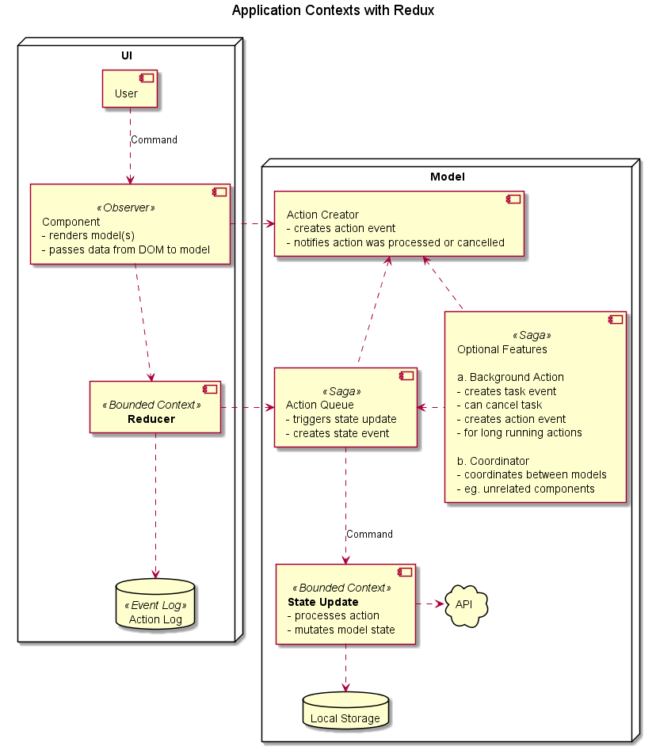

# Redux Saga and CQRS Test with Web Workers

## Intro

We define two bounded contexts: **Redux** and the (view-) **Model**. This separates responsibilities into two realms (threads):

**UI** and **Model**.

## Notes

### Command Query Responsibility Segregation

In Command Query Responsibility Segregation (CQRS) terms, this app pattern uses **mostly events** and **few commands**. Many commands are actually created inside the user's head, see Tomas Weiss' [article](https://blog.javascripting.com/2015/12/08/the-human-brain-is-a-vital-front-end-component/). This results in DOM-events (click, etc.), which are handled by the application. It is probably useful to keep this in mind when designing a UI, since commands can be rejected (unlike events). Rejected commands (eg. bad request) can potentially lower the user experience.

### Event Sourcing

Redux uses Event Sourcing but the model can use any pattern. So this pattern uses only few action types. See Oliver Libutzki's [article](https://dev.to/olibutzki/why-event-sourcing-is-a-microservice-anti-pattern-3mcj). This is useful for simpler programming of the Model's logic.

### Action Pull-Stream

The render update only requires the reducer to handle generic state update events, since Immer abstracts away the immutable updates. This allows to handle most of the logic with the easy structural programming style (using `async/await`).

There is no need to handle async logic with Thunks, Sagas etc. Actions are queued and passed to a single update function (kind of an asynchronous reducer) in a **Pull Stream** pattern.

```javascript
export const updateState = async (state, message, context) => {
  if (message.increment) {
    state.count += 1;
  }
};
```

### Redux Saga

Redux Saga is useful for:

- coordination between the UI and logic realms
- action cancellation and other complex event-based features

### Communication with Web Workers

Immer allows to pass state efficiently between UI and Model inside the Web Worker, see Surma's [article](https://dassur.ma/things/react-redux-comlink/). IE11 support for Web Workers and bundling is hard, it throws a security error.

## TODOs

- app example is WIP
- actually use Web Workers (optionally per module)

## Diagram


